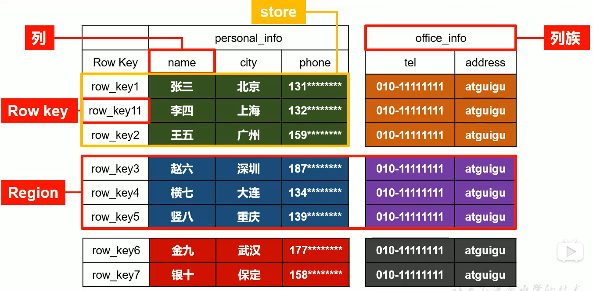
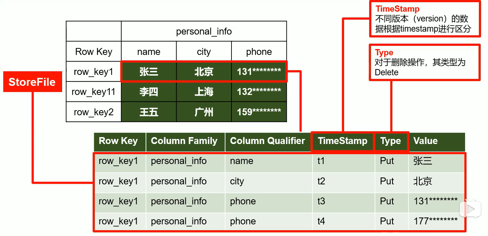
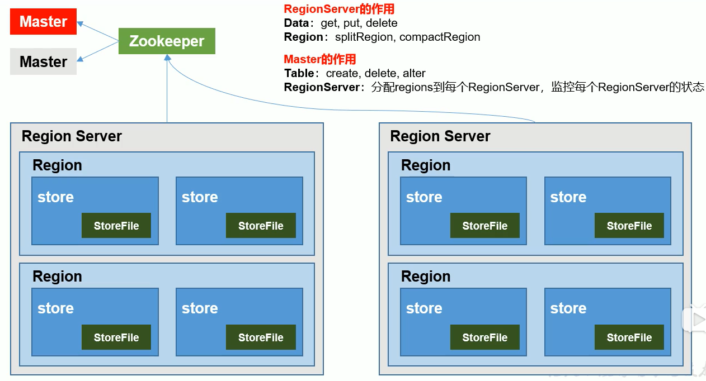
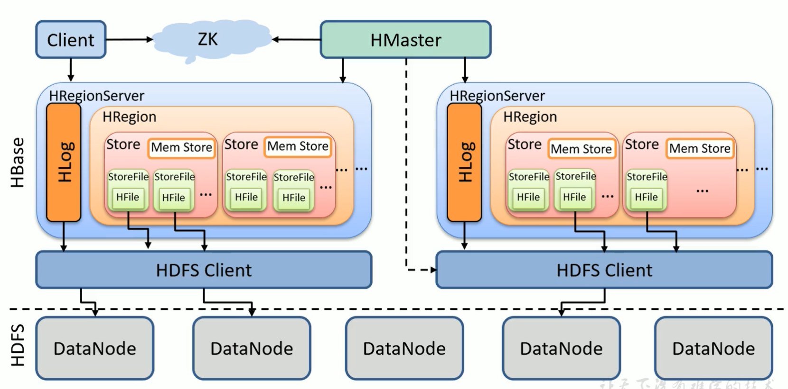
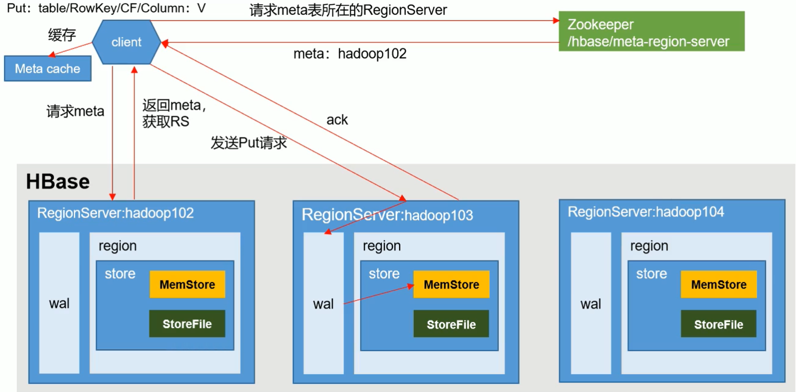
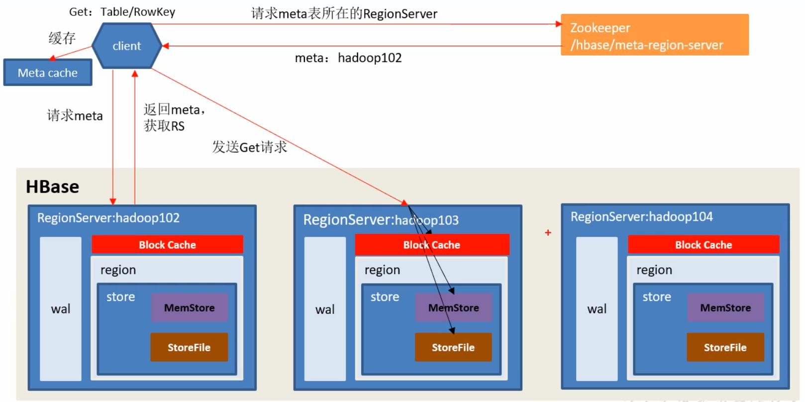

## HBase

### HBase定义
HBase是一种分布式、可扩展、支持海量数据存储的NoSQL数据库

### HBase数据模型
逻辑上，HBase的数据模型同关系数据库很类似，数据存储在一张表中，有行有列，但从HBase底层屋里存储结构(K-V)来看，HBase更像是一个multi-dimensional map

### HBase逻辑结构


### HBase物理存储结构


### 数据模型
1. Name Space
命名空间，类似于关系型数据库的database概念，每个命名空间下有多个表，HBase有两个自带的命名空间，分别是hbase和default，hbase中存放的是HBase内置表，default表示用户默认使用的命名空间
2. Region
类似于关系数据的表的概念，不同的是，HBase定义表时只需要声明列簇即可，不需要声明具体的列。这意味着，往HBase写入数据时，字段可以动态、按需指定。因此，和关系数据库相比，HBase能够轻松应对字段变更的场景
3. Row
HBase表中的每行数据都由一个RowKey和多个Column(列)组成，数据时按照RowKey的字典顺序存储的，并且查询数据时只能根据RowKey进行检索，因此，RowKey的设计十分重要
4. Column
HBase中的每个列都由Column Family(列簇)和Column Qualifier(列限定符)进行限定，例如 info:name, info:age。建表时，只需指明列簇，而列限定符无需预先定义
5. Time Stamp
用于标识数据的不同版本(version)，每条数据写入时，如果不指定时间戳，系统会自动为其加上该字段，其值为写入HBase的时间
6. Cell
由{rowkey,column family:column qualifier,time stamp}唯一确定的单元。cell中的数据时没有类型的，全部是字节码形式存储的

### HBase架构


### HBase Shell操作
1. 基本操作
    - 进入客户端 `bin/hbase shell`
    - 查看帮助命令 `help`
    - 查看当前数据库有哪些表 `list`
2. 表操作DDL
    - 建表 `create 'student', 'info1', 'info2'`
    - 改表 `alter 'student', {NAME=>'info', VERSIONS=>3}`
    - 删表 
        ```shell
        disable 'student'
        drop 'student'
        ```
3. 命名空间
    - 查看命名空间 `list_namespace`
    - 创建命名空间 `create_namespace 'bigdata'`
    - 指定命名空间建表 `create 'bigdata:stu', 'info'`
    - 删除
        ```shell
        disable 'bigdata:stu'
        drop 'bigdata:stu'
        drop_namespace 'bigdata'
        ```
4. 表操作DML
    - 新增 `put 'stu', 'rowkey_1001', 'info:name', 'zhangsan'`
    - 查询 
        1. scan
            - `scan 'stu'`
            - `scan 'stu', {STARTROW=>'rowkey_1001'}`
        2. get
            - `get 'stu', 'rowkey_1001'`
            - `get 'stu', 'rowkey_1001', 'info'`
            - `get 'stu', 'rowkey_1001', 'info:name'`
    - 修改 `put 'stu', 'rowkey_1001', 'info:name', 'zhangsansan'`
    - 删除 `delete 'stu', 'rowkey_1001', 'info:sex'`
    - 删除一个rowkey的数据 `deleteall 'stu', 'rowkey_1001'`
    - 清表 `truncate 'stu'`

### HBase详细架构图


### 写流程


### 读流程


### HBaseAPI 操作(基于1.3.1)
1. 判断表是否存在
    ```java
    // 获取配置文件信息
    Configuration configuration = HBaseConfiguration.create();
    configuration.set("hbase.zookeeper.quorum","hadoop101,hadoop102,hadoop103");

    // 获取管理员对象
    Connection  connection = ConnectionFactory.createConnection(configuration);
    Admin amdin = connection.getAdmin();
    // 判断表是否存在
    boolean exists = admin.tableExists(TableName.valueOf("tableName"))

    // 关闭连接
    admin.close()

    ```
2. 创建表
    ```java
    // 创建表描述器
    HTableDescriptor hTableDescriptor = new HTableDescriptor(TableName.valueOf("tableName"));

    // 创建列族描述器
    HColumnDescriptor hColumnDescriptor = new HColumnDescriptor("cfName");

    // 添加列族信息
    hTableDescriptor.addFamily(hColumnDescriptor);

    // 创建表
    admin.createTable(hTableDescriptor);
    ```
3. 删除表
    ```java
    // 使表下线
    admin.disableTable(TableName.valueOf("tableName"));
    // 删除表
    admin.deleteTable(TableName.valueOf("tableName"));
    ```
4. 创建命名空间
    ```java
    // 创建命名空间描述器
    NamespaceDescriptor namespaceDescriptor = NamespaceDescriptor.create("nsName").build();
    try {
        admin.createNamespace(namespaceDescriptor);
    } catch (NamespaceExistException e) {
        e.printStackTrace();
    } catch (IOException e) {
        e.printStackTrace();
    }
    ```
5. 向表插入数据
    ```java
    // 获取表对象
    Table table = connection.getTable(TableName.valueOf("tableName"));

    // 创建Put对象
    Put put = new Put(Bytes.toBytes("rowKey"));

    // 给Put对象赋值
    put.addColumn(Bytes.toBytes("cf"), Bytes.toBytes("cn"), Bytes.toBytes("value"));

    // 插入数据
    table.put(put);

    // 关闭表连接
    table.close();
    ```
6. 获取数据
    ```java
    // 获取表对象
    Table table = connection.getTable(TableName.valueOf("tableName"));

    // 创建Get对象
    Get get = new Get(Bytes.toBytes("rowKey"))

    // 获取数据
    Result result = table.get(get);

    // 解析数据
    for (Cell cell : result.rawCells()) {
        String cf = Bytes.toString(CellUtil.cloneFamily(cell));
        String cn = Bytes.toString(CellUtil.cloneQualifier(cell));
        String value = Bytes.toString(CellUtil.cloneValue(cell));
    }

    // 关闭表连接
    table.close();
    ```