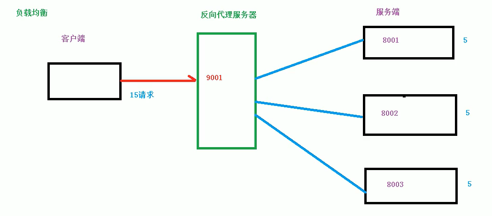
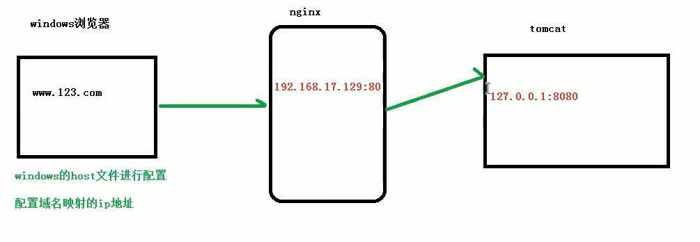
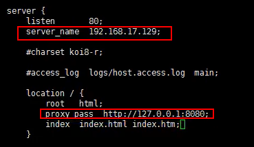
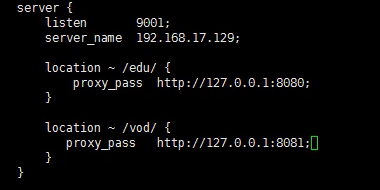
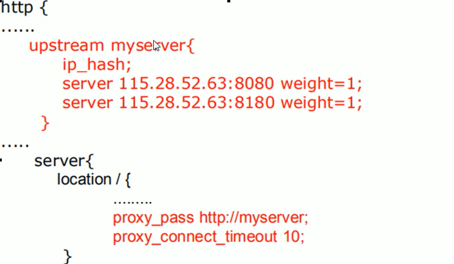

## Nginx

### Nginx简介
- Nginx是一款轻量级的Web 服务器/反向代理服务器及电子邮件（IMAP/POP3）代理服务器，在BSD-like 协议下发行。
- 其特点是占有内存少，并发能力强，事实上nginx的并发能力在同类型的网页服务器中表现较好，
- 中国大陆使用nginx网站用户有：百度、京东、新浪、网易、腾讯、淘宝等

### 正向代理
- 在客户端(浏览器)配置代理服务器，通过代理服务器进行互联网访问

    

### 反向代理
- 反向代理，其实客户端对代理是无感知的，因为客户端不需要任何配置就可以访问，
- 我们只需要将请求发送到反向代理服务，由反向代理服务器去目标服务器获取数据后,
- 再返回给客户端，此时反向代理服务器和目标服务器对外就是一个服务器,
- 暴露的是代理服务器地址，隐藏了真是服务器IP地址
  
    

### 负载均衡
- 单个服务器解决不了，我们增加服务器的数量，然后将请求分发到各个服务器上
- 将原来请求集中到单个服务器上的情况改为将请求分发到多个服务器上
- 将负载分发到不同的服务器，也就是我们所说的负载均衡

    

### 动静分离
- 为了加快网站的解析速度，可以把动态页面和静态页面由不同的服务器来解析
- 加快解析速度，降低原来单个服务器的压力

    
    
### Ngnix的安装
1. [网站下载](http://nginx.org/en/download.html)
2. ngnix相关依赖安装
    - pcre
        1. 解压文件
        2. 进入解压目录，执行`./configure`
        3. 执行 `make && make install`
        4. 查看安装结果 `pcre-config --version`
    - openssl
    - zlib
    - 一键安装多个依赖：`yum -y install gcc zlib zlib-devel pcre-devel openssl open-devel`
3. 安装Nginx
    - 解压：`tar -xzvf nginx-1.12.2.tar.gz`
    - 进入解压目录，执行`./configure`
    - 执行 `make && make install`
    - 安装成功后在usr文件夹`local/nginx`，在sbin里有启动脚本
4. 防火墙相关
    - 查看开放的端口号 `firewall-cmd --list-all`
    - 设置开放的端口号
        1. `firewall-cmd --add-service=http --permanent`
        2. `sudo firewall-cmd --add-port=80/tcp --permanent`
    - 重启防火墙 `firewall-cmd --reload`

### Nginx常用命令
1. 首先要进入ngnix目录才能执行 `/usr/local/nginx/sbin`
2. 查看版本号 `./nginx -v`
3. 启动nginx `./nginx`
4. 关闭nginx `./nginx -s stop`
5. 重新加载nginx `./nginx -s reload`

### Nginx配置文件
1. 配置文件位置 `nginx/conf/nginx.conf`
2. 配置文件组成
    - 全局块
        > 从配置文件开始到events块之间的内容，主要会设置一些影响nginx服务器
        > 整体运行的配置指令，主要包括配置运行nginx服务器的用户(组)、允许生
        > 成的worker process数，进程PID存放路径、日志存放路径和类型以及配置
        > 文件的引入等
    	```shell
    	#user  nobody;
		worker_processes  1;

		#error_log  logs/error.log;
		#error_log  logs/error.log  notice;
		#error_log  logs/error.log  info;

		#pid        logs/nginx.pid;
    	```
    - events块
    	> 主要影响nginx服务器与用户的网络连接，常用设置包括是否开启对
    	> 多work process下的网络连接进行序列化，是否允许同时接收多个网络连接
    	> 选取哪些事件驱动模型来处理连接请求，每个work process可以同时支持的
    	> 最大连接数等
    	```shell
    	events {
    		worker_connections  1024;
		}
    	```
    - http块
    	
    	> 包括文件引入、MIME-TYPE定义、日志自定义、连接超时时间、单链接请求数上限等
    - server块
    	> 每个http块可以包含多个server块，而每个server就相当于一个虚拟机
    	> 而每个server块也可以分为全局server块，以及可以同时包含多个location块

### Nginx配置实例-反向代理
1. 需求
	
2. 配置
	
	
### Nginx配置实例-反向代理2
1. 需求
	
2. 配置
	

### location指令说明
该指令用于匹配URL
```shell
location [ = | ~ | ~* | ^~ ] uri { 

}
```
- `=` : 用于不含正则表达式的uri前，要求请求字符串与uri严格匹配，如果匹配成功，就停止继续向下搜索并立即处理该请求
- `~` : 用于表示uri包含正则表达式，并且区分大小写
- `~*` : 用于表示uri包含正则表达式，并且不区分大小写
- `^~` : 用于不含正则表达式的uri前，要求nginx服务器找到标识uri和请求字符串匹配度最高的location后，立即使用此location处理请求，而不再使用location块中的正则uri和请求字符串做匹配
- 注意：如果uri包含正则表达式，则必须有`~`或`~*`标识

### Nginx配置实例-负载均衡
1. 需求
	
2. 配置
	

### 负载均衡分配策略
1. 轮询(默认)
	
	> 每个请求按时间顺序逐一分配到不同的后端服务器，如果后端服务器down掉，能自动剔除
2. weight
	
	> weight代表权重，默认为1，权重越高被分配的客户端越多
	```shell
	upstream server_pool{
	server 192.168.5.21 weight=10;
	server 192.168.5.22 weight=10;
	}
	```
3. ip_hash
	> 每个请求按访问ip的hash结果分配，这样每个访客固定访问一个服务器，可以解决session问题
	```shell
	upstream server_pool{
	ip_hash;
	server 192.168.5.21;
	server 192.168.5.22;
	}
	```
4. fair(第三发)
	> 按后端服务器的响应时间来分配请求，响应时间短的优先分配
	```shell
	upstream server_pool{
	server 192.168.5.21;
	server 192.168.5.22;
	fair;
	}
	```
