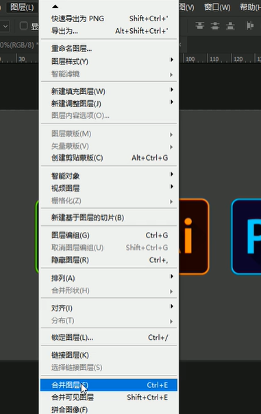
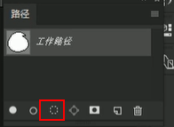
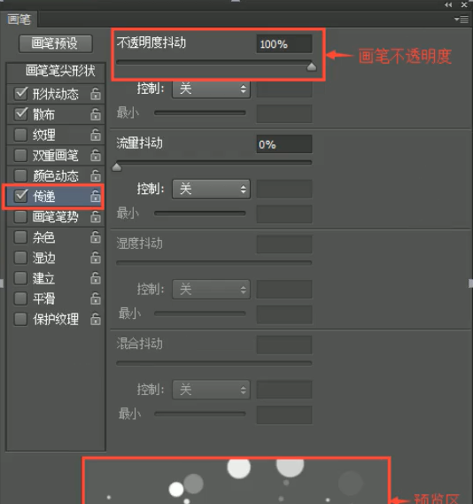

## Photoshop

### 设计师常用文件格式
1. JPG(压缩)
2. PNG(透明)
3. GIF(动态)
4. PSD(分层)

### 新建文档与注意事项
1. 快捷键 Ctrl+N

    

2. 注意事项
    - 文档名称要规范，根据设计文档进行命名
    - 文档类型一般选择默认大小
    - 一定要根据设计文档的类型(网页或印刷)，检查设计单位，印刷用毫米，网页或UI单位用像素
    - 颜色模式：印刷类用CMYK，网页或UI设计用RGB

### 图片的放大与缩小
1. 方法1：选择缩放工具，按鼠标不放左右摆动拖动鼠标即可放大或缩小

    

2. 方法2： 按住Ctrl+按加号方法，按减号缩小
3. 方法3： 按住Ctrl+空格，此时鼠标会变成放大镜，按住左键不放
    - 放大：向右摆动
    - 缩小：向左摆动

### 画布的移动
1. 往往放大图像后需要看图像中的局部位置，我们可以使用抓手工具进行移动画布
2. 快捷键：空格(放大图像后方可使用)

### 移动工具
1. 快捷键 v

    

2. 功能：移动文档内的图层，组、参考线，也快吃复制图层或组
3. 当文件中有多个图层或组

    

    - 我们可以在移动工具的情况下，将自动选择"图层或组",勾上，这样会自动找到对应的图层
    - 如果不勾选，就按Ctrl 来自动选择图层或组
4. 移动复制功能：在移动工具情况下， Alt + 左键拖拽对象即可
5. 跨文件复制： 
    - 打开多个文件
    - 在一个文件中，选择移动工具
    - 选择其中一个文件，拖拽到另外一个文件的选项卡
    - 向下拖拽鼠标，变成加号后松开即可

### 图层对齐
1. ps软件中包含左中右上中下对其

    

    - 按住Shift+选图层，多个图层，点击相应的对齐方式即可

### 自由变换
1. 【编辑】-【自由变换】

    

2. 快捷键： Ctrl+T
3. 功能： 改变所选图层大小，旋转
4. 用法： 首先选择图层，Ctrl+T,把鼠标放到定界框内部拖拽，改变大小，把鼠标放到定界框外，可以进行旋转
5. 在此模式下，还可以进行鼠标右键，然后可以进行翻转等相应的操作
    
    

6. 调整各个图层的遮挡，在右侧图层进行上下拖拽调整图层上下位置

### 选框工具
1. 快捷键： M
    
    

2. 绘制矩形选取或椭圆选区
3. 如果绘制正方形或圆形选区，需要按住Shfit键
4. 以某点为中心绘制正方形或圆形选区，需要按住Shit+Alt键
5. 单行或单列，是为一个像素相应的选区
6. 取消选区
    - 绘制完成之后，在选区工具的情况下，鼠标点击空白处
    - 【选择】-【取消选择】 快捷键为 Ctrl+D
7. 布尔运算
    
    

    - 新选区(默认，特点可以移动选区)， 如果已经存在选区，新绘制时会替代原来的选区
    - 添加到选区，将新选区添加到原来的选区中(Shfit键)
    - 从选区中减去， 将当前创建的选区从原来的选区中减去(Alt键)
    - 与选区交叉，新建选区时，只保留原有选区与创建选区交叉的部分(Alt+Shift键)
8. 选区固定大小
    -选择选区工具，在选项栏中选择固定尺寸，点击空白处即可绘制固定好尺寸的选区

    

### 关于颜色
在ps软件中分为前景色与背景色(前面叫前景色，后面叫背景色)

1. 填充颜色到选区
    - 填充前景色：Alt+退格键
    - 填充背景色：Ctrl+退格键
2. 注意：填充颜色前先新建图层，将颜色添加到新的图层
3. 填充：【编辑】-【填充】 快捷键：Shfit+F5

### 选区的修改

1. 边界：不常用
    
    

2. 平滑：不常用
    
    

3. 扩展：将选区向外扩大指定的大小(像素，不易过大)

    

4. 收缩：将选区向内缩小指定的大小(像素，不易过大)

    

5. 羽化：将选区边缘变模糊效果，快捷键 Shfit+F6

      

    - 注意弹出该对话框，说明选区太小，羽化太大

        

### 关于撤销
1. 【编辑】-【后退一步】 快捷键 Alt+Ctrl+Z

    

2. 还可以打开历史记录面板，对操作的步骤进行反复撤销操作 【窗口】-【历史记录】
    
    

### 图层基础知识
1. 图层的显示或隐藏
    - 点击图层前面得眼睛图标切换显示或隐藏

        

2. 原位复制图层
    - 【图层】-【新建】-【通过拷贝图层】 快捷键 Ctrl+J

        

    - 将图层拖拽至图层面板上新建图层按钮上

        

3. 新建图层
    - 在图层面板下方点击新建按钮

        

    - 带对话框新建图层 快捷键 Ctrl+Shfit+N

        

    - 不带对话框新建图层 快捷键 Ctrl+Alt+Shfit+N
4. 调整图层顺序
    - 【图层】-【排列】-【前移一层】

        

    - 将图层选中，然后拖拽至某个图层的下方或上方，看到一个提示线松开鼠标即可

        

5. 载入图层对象的选区
    - 按住Ctrl键，在图层缩略图上点击即可

        

6. 图层合并
    - 【图层】-【合并图层】 快捷键 Ctrl+E

        

7. 图层的选择
    - 按住Shift键可以连续选择图层，按住Ctrl键可以挑选选择图层
8. 图层锁定

    
    
    - **锁定透明像素**：透明区域不能编辑
    - 锁定图像像素：不能进行任何像素的编辑(改变颜色、删除颜色)，可以移动位置
    - 锁定位置：不能移动位置
    - 防止在画板外自动嵌套：如果新建的是画板文档，锁定后不能将画板1中的元素移动到另外一个画板2
    - **锁定全部**：不能对当前图层做任何更改
9. 图层透明度
    - 将当前图层进行透明化处理，可以看到下层图像内容

### 套索工具组
快捷键 L

1. 套索工具
    - 功能：可以创建不规则选区
    - 用法：直接使用鼠标左键不放到开始位置即可
2. 多边形套索工具
    - 功能：绘制直角或尖角的选区
    - 用法：单击鼠标左键松开，反复同步操作，直至完成。如果操作错误退回上一步，按Delete键
    - 注意：按住空格时有抓手可以移动图
3. 磁性套索工具
    - 功能：工具可以自动识别背景与前景的边缘，适用于背景色单一或边缘清晰对比较强的图像
    - 用法：单击鼠标左键松开，顺应所选对象的边缘，直至完成

### 图像基础合成
1. 透底图
    - 一张图片，将我们需要的地方保留，不需要的地方制作成透明
    - 透底图一定要存储为psd或png格式才支持透明
2. 图像合成
    - 将两张或多张图，放到一起，形成一个新的画面
    - 要打开一个图像或新建一个画布
    - 将我们需要合成的图片直接拖到新的画面中
    - 组合成一个新的画面

### 快速选择工具组
快捷键 W

1. 快速选择工具
    - 功能：快速选择需要载入选区的部分
    - 用法：单击鼠标左键拖动，向外拉扩展，在使用过程中需要根据需要不断调整笔触大小
    - 笔触大小调整方法：左括号变小，右括号变大，主要调整为英文输入法
2. 魔棒工具

    
    - 功能：可以快速选择背景色单一的色彩范围
    - 容差：选择的颜色范围
    - 连续：如果选择连续，那么不连续的颜色将不会被选中
3. 反选
    - 快捷键：Shfit+Ctrl+I
    - 功能：反向选择，选择当前选区之外的部分
    
        

### 渐变工具
- 渐变工具应用十分广泛，它可以填充到选区或者整个图层、蒙版、通道、叠加到图层
- 也可以填充形状或者描边
- 渐变工具不能用于索引和位图模式
- 快捷键 G

    

1. 渐变编辑器

        

    - 预设区：软件自带的常用渐变库
    - 设置不透明度：选择需要设置的不透明色标，在下面不透明度框中输入数字即可，删除向下拉，添加是点击空白处
        1. 设置色标，双击或单击点击颜色更改即可
        2. 添加色标，在色标轨道上任意位置点击即可添加色标
        3. 删除色标，选择需要删除的色标，向下拖动即可删除
        4. 色标的位置，选择色标拖动到合适的位置，也可以输入精确位置数据
        5. 复制色标，选中色标，点击空白处，或按住Alt键拖动复制
2. 渐变类型

    
    
    - **线性渐变**：以直线或角度线的形式表达渐变效果
    
        
        
    - **径向渐变**：以起点到终点为半径，绘制中心向四周扩散或放射的形式表达渐变
        
        
        
    - 角度渐变：以直线为起点，顺时针的形式呈现渐变效果
        
        
        
    - 对称渐变：以中心为轴向两边延伸出相同渐变
        
        
        
    - 菱形渐变：以起点为中心向四周延伸菱形
    
        

### 初识路径

- 外观：路径是由一个或多个直线段及曲线段组成，外观上看它是一个黑色实线
- 用途：**抠图**、路径描边、绘画

1. 路径的构成
    - 节点(锚点)：定义了每一段路径的起点与终点，分为平滑锚点和角点
    - 路径段：锚点与锚点之间的线段，分为曲线段和直线段
2. **路径转换为选区**
    - **Ctrl+Enter 生成选区**
    - 在钢笔工具栏的选项卡中点击【选区】

        

    - 在路径面板中，点击下方的路径转换为选区按钮

        

### 钢笔工具
一般情况下使用该工具多用于抠图，所以选择这个工具时检查属性栏中应该选择“路径”
快捷键 P

1. 使用方法
    - **直线段绘制**
        1. 首先选择钢笔工具，判断锚点与下一个锚点之间是直线还是曲线，
        2. 如果是直线就点击松开鼠标，以此类推
    - 曲线段绘制
        1. 首先选择钢笔工具，判断锚点与下一个锚点之间是直线还是曲线，
        2. 如果是曲线，那么按住左键不放拖动鼠标，拖动到路径吻合后松开鼠标
        3. 按住Alt键在锚点处将多余的控制手柄打断，以此类推
    - 注意：Ctrl+Enter 生成选区
2. 钢笔工具抠图与选区抠图的区别
    - 选区抠图非常快，节约时间，但是抠出来的效果非常粗糙，不适合产品抠图
    - 钢笔抠图边缘非常平顺，适合产品抠图，工具需要时间联系方能掌握，抠图较慢
3. 添加锚点工具：可以在路径上任意位置点击用来添加锚点
4. 删除锚点工具：可以对路径上已有锚点进行删除操作
5. 转换点工具：
    - 可以将角点转换成平滑节点(点击)
    - 可以将平滑节点转换成角点(拖动)
6. 路径是可以存储，直接对图片进行保存即可，后续打开可以继续使用

### 路径选择
快捷键 A

1. **路径选择工具**(小黑)
    - 功能：用来选择路径，并可对路径进行自由变换及复制(按住Alt键)
2. **直接选择工具**(小白)
    - 功能：可以选择路径中锚点，并且可以修改选中锚点的位置，还可以修改选中锚点来修改路径弯曲度

### 画笔工具组
快捷键 B
- 可以使用该工具在画面进行涂抹及绘画，也可以利用画笔工具对设计作品画面进行装饰
- 画笔工具颜色由前景色决定，我们可以利用不同的笔刷进行涂抹绘画

1. 画笔属性

    

    - 大小更改：键盘中括号，左括号缩小，有括号变大
    - 生硬度更改：Shfit+[ 或Shift+],在面板拖拽也可以
2. 画笔面板常用设置
    - 间距
    - 大小
    - 形状动态

        

    - 散布

        

    - 颜色动态

        

    - 传递
    
        

3. 画笔自定义
    - 可以根据需要自己绘制一个自定义形状进行定义画笔
    - 画笔颜色设置
        1. 黑色 不透明
        2. 灰色 半透明
        3. 白色 透明(不要用这个颜色定义画笔)
        4. 其他颜色 半透明
    - 【编辑】-【定义画笔预设】
4. 画笔路径描边
    - 绘制好路径后，设置画笔属性，在画笔工具情况下直接按回车即可使用画笔对路径进行描边
    - 绘制好路径后，设置画笔属性，在钢笔工具、形状工具、小白小黑工具组的情况，在路径上单击右键即可描边

### 图案定义
- 我们可以自定义绘制一些图案对其进行定义，方便后续使用，也可以将网上的图案进行定义方便实用
- 绘制好图案 【编辑】-【定义图案】，使用填充选项中的图案，找到指定图案进行填充即可

### 选区描边
- 功能：对选区边缘内部、中部、外部进行描边
- 【编辑】-【描边】

### 文字工具
- 文字工具输入时不需要新建图层，文字的颜色是由前景色决定
- 快捷键 T

1. 文字键入方法
    - 选择文字工具，检查前景色及字体大小属性，在空白处点击即可
2. 文字提交的方法
    - 键入文字后在选项栏中点击【对号】或者 Ctrl+Enter
3. 文字属性栏
    - 在选择文字工具的情况下才显示

    

4. 文字的编辑
    - 选择文字工具，在已键入文字上方点击即可

5. 字符面板
    
    

    - 字体大小：Ctrl+Shift+小于或大于号
    - 行距：Alt+上下方向键
    - 字距：Alt+左右方向键
    - 字与字间距：光标定位到两字之间，Alt+左右方向键
6. 段落文字
    
    

    - 使用文字工具在空白处单击拖动拉出文本框即可

### 矢量图与位图
- 位图是由像素点组成，没有任何保护措施，所以拉大缩小后会失真，但颜色非常丰富
- 矢量图是由路径加像素组成伪矢量(路径在保护他的像素)，变换大小不失真，颜色单一不丰富

### 形状工具组

- 在创建形状时，图层上会自动创建一个形状属性的图层
- 应用领域：网页设计、UI设计、创意插画、电商设计
- 使用方法：选择工具拖动绘制或选择工具点击空白处自定义尺寸绘制
- 注意：通常情况下选择该工具会选择**形状**属性

- 形状，绘制一个形状属性的图层，既有颜色又包含路径属性
- 路径，绘制一个新路径
- 像素，绘制一个有颜色，无路径的像素层(需手动创建图层)

1. 矩形工具
    - 绘制正方形或长方形的形状工具
2. 角矩形工具
    - 绘制带有圆角的属性的形状(可以在属性面板直接更改圆角的大小)
3. 椭圆工具
    - 绘制正圆形或椭圆形形状工具
4. 多边形工具
    - 可以绘制多边形，例如三角形，多边形，根据参数进行调整即可
5. 直线工具
    - 绘制时按Shift建强制水平或垂直绘制直线
6. 自定义形状工具
    - 利用软件自带的形状进行绘制，也可以在选项中载入更多自定义形状进行绘制
7. 填充属性
    
    

    - 无填充：将当前图层填充颜色设置为无得状态
    - 单色填充：颜色为纯色，在对话框的右上角可以点击自定义颜色
    - 渐变填充：将填充改为渐变，更改颜色时双击，复制色标按Alt
    - 图案填充：将形状的填充改为图案填充，可以根据需要更改图案的显示比例
8. 形状描边
    
    

    1. 描边的粗细：可以直接输入数值更改粗细，或直接拖动
    2. 描边选项：实线、虚线、圆形虚线
    3. 对齐类型：内部描边、居中描边、外部描边
    4. 角点类型：(直角、圆角、切角)如果对齐类型选择为外部分时改选项无效
    5. 端点类型：(平头、圆头、包头)该选项是针对开放路径起作用
9. 形状尺寸：根据自己的需要可以对形状宽度与高度进行修改
10. 形状的布尔运算

    

    - 新建图层：没绘制一个形状就创建一个形状图层
    - 合并形状：后面绘制的形状一直与前面绘制的形状在一个图层上(按Shift)
    - 减去顶层形状：用后面的绘制形状将前面绘制的形状减去(按Alt)
    - 形状相交：后面绘制的形状与前面绘制的形状重叠的部分保留下来(按Alt+Shift)
    - 排除重叠：后面绘制的形状与前面绘制的形状重叠的部分区域镂空
    - 合并形状组件：将多个路径合并成一个路径，不能再单独修改

### 图层编组
该功能可以方便快捷管理图层与组
快捷键 Ctrl+G

### 形状合并
- 【图层】-【向下合并】
- 选择多个形状向下合并即可，多个形状合并时取最上层颜色为结果色，形状合并后依然保留多个路径

### 形状绘制技巧
在绘制形状时我们可以在鼠标左键及Shift键不放，同时按空格键可以改变绘制形状的位置

### 创建剪切蒙板
将上层图层内容防止在下层图层内，并且可以以下层边缘为基准自动进行蒙版

- 快捷键：Ctrl+Alt+G
- 其他方法：按住Alt键，将鼠标悬停在两个图层之间点击即可
    
    

### 色彩是什么？
- 色彩是可见光当值的视觉现象，光是一种电磁波，不同的波长可见光投射到物体上一部分被吸收，一部分被反射到人眼，大脑把这种刺激反应到色彩信息，所以说没有光就没有色彩可言

### 常用颜色模式

- 位图
- 灰度
- RGB颜色(最常用)
    1. 基于光学色调原理
    2. R：红色， G：绿色， B：蓝色
    3. 参数：通过0-255之间整数混合
        - 红色：R255 G0 B0
        - 绿色：R0 G255 B0
        - 蓝色：R0 G0 B255
        - 纯黑：R0 G0 B0
        - 纯白：R255 G255 B255

    

- CMYK颜色(常用)
    1. 青色+洋红+黄色+黑色
    2. 油墨的混色模式，用于印刷或打印
    3. 参数：通过0-100之间整数混合
        - 青色：C100 M0 Y0 K0
        - 洋红：C0 M100 Y0 K0
        - 黄色：C0 M0 Y100 K0
        - 黑色：C0 M0 Y0 K100

    

### 颜色三要素
- H：色相
    1. 指颜色的相貌
- S：饱和度
    1. 指颜色的浓度，颜色的鲜艳程度
- B：明度
    1. 指颜色明暗程度

### 颜色分类
- 原色
    
    

    - 色彩中不能再进行分解的颜色称为原色，通常指的是红色、绿色、蓝色
- 间色

    

    - 两个原色混合得到间色，通常指的是青色、洋红、黄色
- 复色
    
    

    - 由原色与间色混合、或者间色与间色混合的得到复色

### 颜色通道

一个图谱包含：复(综)合通道、红色通道、绿色通道、蓝色通道
1. 通道的作用
    > 通道用来存储颜色信息、可以调整颜色、或者载入选区

    1. 纯白色：表示存储的颜色的色值高为255
    2. 纯黑色：表示存储当前通道的颜色的色值为0
    3. 灰色：表示存储当前通道的颜色的色值为0-255之间
    4. 总结：以上三种词汇是指的是对于当前通道来说的，如果通道中是白色，一种可能是当前通道中的颜色色值较高，一种是当前原色为白色
2. 调色与校色
    - 调色：将正常图片调整为我们想要的颜色风格
    - 校色：将不正常的图片处理为正常的颜色图片

### 亮度/对比度
- 功能：调整图像中的亮度与对比度，使图像中亮的更亮，暗的部分更暗，也可以单独调整亮度，不调整对比度
- 快捷键 Alt+I+J+C

### 直方图
- 功能：用来查看图像彩色信息是否正常
- 技巧：将直方图下拉菜单中的全部分通道视图打开，查看山峰中的信息是否平衡

### 色阶

- 快捷键：Ctrl+L
- 通道：可以选择某一个通道进行调整颜色的明暗或鲜艳程度
- 山峰(直方图)：会有黑场、灰常、白场、将黑场向右调整对应通道会变暗，将白场向左调整对应的通道会变亮
- 注意：如果需要使用色阶来矫正图像颜色，那么这张照片一定要是原片，否则该方法将不能调整，并不是所有照片都需要对其所有通道进行调整

    

### 色彩平衡(加色命令)
- 【图像】-【调整】-【色彩平衡】
- 快捷键：Ctrl+B
- 功能：调整图像中的阴影、中间调(默认)、高光的色彩平衡度

### 色相饱和度
- 【图像】-【调整】-【色相/饱和度】
- 快捷键：Ctrl+U
- 功能：更改图像中的色相、饱和度、明度
- 手动调整：选择鼠标左右拖动即可自动识别所要调整的颜色，只调整饱和度
- 着色：为当前图层整体指定一种颜色

    

### 去色
- 【图像】-【调整】-【去色】
- 快捷键：Ctrl+Shift+U
- 将当前图像变为黑白灰，将彩色信息去除

### 黑白
- 【图像】-【调整】-【黑白】
- 快捷键：Ctrl+Shift+Alt+B
- 将当前图像变为黑白，可以针对于图像中某一个颜色将它的黑白灰程序进行精细调整

### 曲线
- 【图像】-【调整】-【曲线】
- 快捷键：Ctrl+M
- 功能：它是色相饱和度、色彩平衡、色阶、亮度对比度等功能组合
- 用法：直接使用鼠标在基线上进行拖拽，一般左上角提是变亮，向右下角是变暗，
- 手动调整：选择某一个位置进行上下拖拽

### 可选颜色
- 【图像】-【调整】-【可选颜色】
- 功能：与色相饱和度较为接近，它可以更加精细的对某一个颜色进行细致的调整，例如增加或减少颜色

### 渐变映射
- 【图像】-【调整】-【渐变映射】